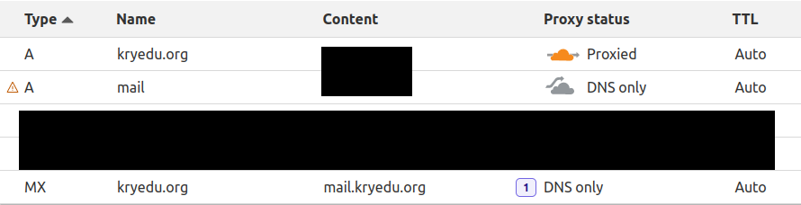
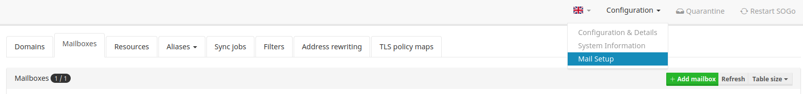

# Mailcow installation on ubuntu 22.04.1
Installing Docker
```
curl -sSL https://get.docker.com/ | CHANNEL=stable sh
```
Installing Docker compose plugin
```
sudo apt update
sudo apt install docker-compose-plugin
```
Becoming root user
```
sudo -i
```
Checking file permission (make sure the output is 0022)
```
umask
```
Installing mailcow
```
cd /opt
git clone https://github.com/mailcow/mailcow-dockerized
cd mailcow-dockerized
```
Initialize mailcow (use a fully qualified domain name e.g. mail.xxxxxx.org)
```
./generate_config.sh
```
Configuration can be changed by
```
gedit mailcow.conf
```
Start the server
```
docker compose pull
docker compose up -d
```
DNS settings (using cloudflare in this example), no proxy for mail domain <br>
\
 <br>
\
Go here to check out the admin panel with the default credentials admin + password moohoo
```
https://${MAILCOW_HOSTNAME}
```
\
Go here to add domain and add mailbox
\
 <br>
\
Check out the webmail to test whether it's working
```
https://${MAILCOW_HOSTNAME}/SOGo
```
## Resources
-https://docs.mailcow.email/i_u_m/i_u_m_install/#installation-via-script-standalone
